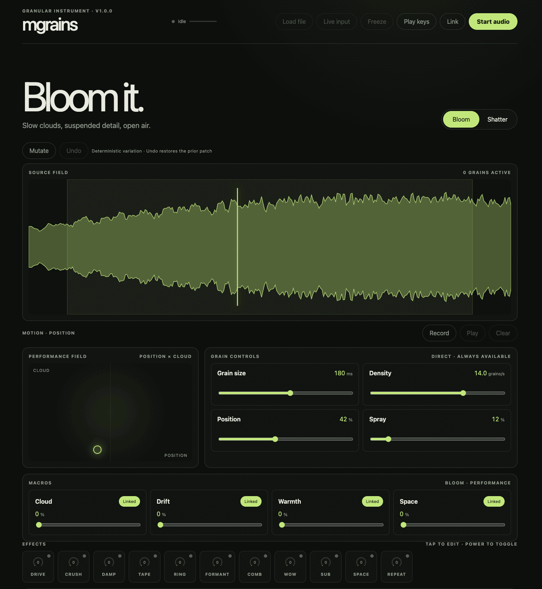

<div align="center">

# mgrains

**A granular instrument — bloom any sound into clouds, or shatter it into rhythm.**

[](./package.json)
[](./LICENSE)
[](#verification)
[](./tsconfig.json)
[](https://react.dev)
[](https://vite.dev)
[](https://developer.mozilla.org/docs/Web/API/AudioWorklet)
[](#progressive-web-app)



</div>

---

`mgrains` is a browser-native granular synthesizer and live effect. Feed it a generated source, an imported file, or a live capture, then perform it in one of two modes — **Bloom** (slow overlapping clouds) or **Shatter** (sample-accurate tempo-synced fragments) — through an XY surface, four performance macros, an eleven-slot effects rack, and a chromatic keyboard. All audio runs in an `AudioWorklet`; the UI never schedules grains.

## Highlights

- **Two modes, one muscle memory** — Bloom and Shatter share the layout but run distinct schedulers, constraints, macros, and graphics, switching through a click-free 180 ms fade-through-silence.
- **Direct grain controls** — Grain Size, Density/Rate, Position, and Spray always on the main surface; region, timing jitter, scan speed, pitch, pitch spread, reverse probability, stereo spread, window, and output in an Advanced panel — all with units.
- **Four macros per mode** — Bloom: Cloud · Drift · Warmth · Space. Shatter: Chop · Scatter · Crush · Repeat. Each sweeps a curated parameter group; **Link/Unlink** keeps hand edits authoritative.
- **11-effect rack** — Drive, Crush, Damp, Tape, Ring, Formant, Comb, Wow, Sub, Space (reverb), Repeat (tempo delay) — each a tile with an amount ring, opening a modal with its parameters and an SVG response curve. A stereo-linked master **limiter** is the final stage.
- **Sources** — ten deterministic demo sounds (random pick), audio-file import, and a 20-second live rolling buffer with **Freeze** and **Clear**.
- **Performance** — large XY surface, draggable waveform position, a multi-lane **motion recorder** — hit record and every dial or macro you move becomes a looping lane (up to 4 per take), and seeded **Mutate** with bounded **Undo**.
- **Play it** — polyphonic chromatic playing from the computer keyboard (Ableton layout) and **Web MIDI** (note on/off + velocity), up to 8 voices with oldest-note stealing.
- **Shatter sequencer** — BPM, straight/dotted/triplet divisions, and a deterministic 16-step lane (gate, probability, pitch offset, reverse, ratchet).
- **Presets & sync** — 10 curated factory presets plus user presets in IndexedDB (versioned, motion + source-label aware, with a relink prompt); optional **Ableton Link** tempo sync via the companion **mpump** link-bridge; optional **mbus publish** — the "Bus" toggle next to Link offers the master output to the [mbus](https://mbus.mpump.live) patchbay as a source named `mgrains` (tab-to-tab WebRTC via the same bridge, off by default, harmless without it).
- **PWA** — installable manifest and a network-first service worker that precaches the hashed app assets (full offline use after one visit, deploy-safe updates).

## Run locally

```bash
npm install
npm run dev
```

Open the URL Vite prints and click **Start audio** (browser audio requires a user gesture). **Use headphones before enabling Live input** to avoid feedback.

## Scripts

| Script | Purpose |
| --- | --- |
| `npm run dev` | Vite dev server with HMR |
| `npm run build` | Type-check (`tsc -b`) and production build |
| `npm run preview` | Serve the production build locally |
| `npm run lint` | ESLint |
| `npm run test` | Vitest (run once) |
| `npm run test:watch` | Vitest in watch mode |
| `npm run typecheck` | Type-check without emit |
| `npm run check` | **lint + test + build** (the full gate) |

## Controls

**Mouse / touch / pen** — drag the waveform to set Position; drag the XY surface for Position × Spray; all knobs have keyboard-accessible slider alternatives.

**Computer keyboard** (when **Play keys** is on — other shortcuts are suppressed to avoid collisions):

| Keys | Action |
| --- | --- |
| `A S D F G H J K L ;` | white notes (chromatic, polyphonic) |
| `W E T Y U O P` | black notes |
| `Z` / `X` | octave down / up |
| `C` / `V` | output level down / up |

**MIDI** — any connected device plays the same voices as soon as audio is running (no toggle needed); note velocity scales each voice's level. MIDI is an optional enhancement; the app is fully usable without it.

## Architecture

```text
main thread                         audio thread (AudioWorklet)
───────────                         ───────────────────────────
App.tsx ── patch/notes ──▶ AudioEngine ── postMessage ──▶ granular.worklet.ts
  │  (sanitized GrainPatch,            (AudioContext graph,        │
  │   {offset,velocity} voices)         live-input buffer)         ▼
  ◀────────── telemetry (~30 Hz) ─────────────────────────  GranularCore (pure DSP)
                                                              · fixed 64-grain pool
                                                              · seeded RNG (deterministic)
                                                              · per-sample param smoothing
                                                              · FX chain → master limiter
```

- **The worklet owns all scheduling.** There is no UI-timer grain scheduling.
- **`GranularCore`** is framework-free, deterministic (seeded `XorShift32`), and allocation-conscious (effects expose an allocation-free `processInto`).
- **Parameter ownership:** grain-local values are captured at grain birth; continuous values (output, FX amounts) are one-pole smoothed; mode changes fade through true silence.

## Verification

```bash
npm run check   # lint + 445 tests + production build
```

Tests are deterministic and live next to the code (DSP core, effects, contracts, schedulers, RNG, windows, presets, instrument, transport). Note: Vitest runs in a Node environment, so React components and live audio are covered by manual QA below, not unit tests.

## Permissions & privacy

- **Microphone / line input** is requested only when you enable **Live input**, and degrades gracefully if denied.
- **Web MIDI** is requested once you start audio (a user gesture), and is optional.
- Everything is local: presets and any data live in your browser's IndexedDB. No accounts, no network, no telemetry.

## Browser notes & limitations

- `AudioWorklet` needs a secure context in production (`localhost` is fine for dev).
- The engine uses the real `AudioContext.sampleRate` and never assumes 44.1/48 kHz.
- Headless/automated browsers may expose no audio device; the app times out with an actionable error instead of hanging.
- A PWA install does **not** provide background or lock-screen audio.
- Ableton Link sync requires the companion **mpump link-bridge** running locally (`ws://localhost:19876`); without it the Link panel simply shows "searching".
- **mbus publish** rides the same link-bridge; without it the "Bus" toggle just keeps retrying quietly and nothing is published. Audio flows tab-to-tab over WebRTC and never leaves the machine.

## Physical-device QA checklist

Automated tests cover the DSP and logic; the following must be checked by ear on real hardware before a release:

- [ ] Audible stereo playback in Chrome, Safari, and Firefox (headphones/controlled output)
- [ ] All four direct controls (Grain Size, Density, Position, Spray) respond cleanly
- [ ] Bloom ↔ Shatter switch is click-free; both modes are audibly distinct
- [ ] Each macro (Cloud/Drift/Warmth/Space, Chop/Scatter/Crush/Repeat) sweeps musically
- [ ] Each FX (Drive…Repeat) engages without artefacts; master limiter holds the ceiling
- [ ] Polyphonic chords from the computer keyboard and from a MIDI controller (with velocity)
- [ ] Live input: built-in mic, physical line-in, USB interface; permission denial; Freeze; Clear; device disconnect; no runaway feedback
- [ ] Motion record → play → clear behaves and stays in sync
- [ ] Presets: save, reload, delete; factory presets load; relink prompt on source mismatch
- [ ] Ableton Link locks tempo with the mpump bridge + another peer
- [ ] Mobile Safari / Android: layout usable, audio starts, no thermal/stability surprises
- [ ] `prefers-reduced-motion`: flying particles replaced by stable markers
- [ ] Offline: loads after first successful visit (service worker)

## Repository map

```text
src/
  App.tsx                       integrated UI + performance wiring
  audio/
    contracts.ts                canonical GrainPatch, ranges, messages, sanitize
    AudioEngine.ts              AudioContext graph + worklet lifecycle
    granular.worklet.ts         real-time worklet adapter
    demoSource.ts               ten deterministic demo sources + peaks
    macros.ts                   macro → parameter mappings + Link model
    mutate.ts                   seeded deterministic patch variation
    factoryPresets.ts           10 curated factory presets
    dsp/
      GranularCore.ts           grain engine + FX chain + master limiter
      rng.ts, windows.ts        seeded RNG, grain envelopes
      shatterTiming.ts          tempo/division → sample frames
      StereoCircularBuffer.ts   live rolling buffer
      effects.ts                drive, bitcrush, sample-rate reduce, one-pole, delay line
      reverb.ts tempoDelay.ts tape.ts formant.ts ringMod.ts comb.ts wow.ts sub.ts limiter.ts
  instrument/
    qwertyKeymap.ts             Ableton computer-keyboard layout
    voiceAllocator.ts           8-voice allocation with oldest-steal
    midi.ts                     Web MIDI parsing + input wrapper
  performance/motion.ts         deterministic one-lane motion recorder
  storage/presets.ts            versioned preset serialize/migrate + IndexedDB store
  transport/abletonLink.ts      Ableton Link bridge WebSocket client
  transport/mbus/               vendored mbus-client (patchbay publish; see its index.ts header)
  components/                   waveform, XY pad, parameter/macro/preset controls
    fx/                         FX bar, modal, SVG curves, FX rack
public/                         manifest, service worker, app icon, CNAME
.github/workflows/              GitHub Pages deploy
```

## Progressive Web App

`public/manifest.webmanifest` + `public/sw.js` make `mgrains` installable. The service worker is **network-first for navigations** (so a deploy never serves a stale shell) and cache-first for hashed assets. At install it precaches the shell plus the content-hashed build assets listed in a generated `precache-manifest.json` (emitted by a small Vite plugin), so the full app — including the audio worklet — works offline after a single successful load.

## Deployment

Pushes to `main` are deployed by GitHub Actions (`.github/workflows/deploy-pages.yml`) to GitHub Pages, served at the custom domain **[mgrains.mpump.live](https://mgrains.mpump.live)**. Because it's a root-domain deploy, the build is **root-relative** (no base-path override) and `public/CNAME` pins the domain across deploys. The workflow self-enables Pages (`configure-pages` with `enablement: true`); set **Settings → Pages → Source** to **GitHub Actions** if prompted.

## License

[GNU Affero General Public License v3.0 or later](./LICENSE). All factory sources are generated by repository code — no third-party audio is bundled.
